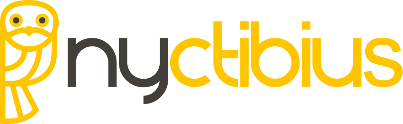

# Nyctibius - Simplificación de la integración de datos sociodemográficos.

<!-- badges: start -->
[](https://github.com/biomac-lab/harmonize/blob/main/README.md)
[](https://github.com/biomac-lab/harmonize/blob/main/README.es.md)
[](https://opensource.org/license/mit/)
[](https://github.com/r-lib/usethis/actions/workflows/R-CMD-check.yaml)
[](https://app.codecov.io/gh/%7B%7B%20gh_repo%20%7D%7D?branch=main)
[](https://www.reconverse.org/lifecycle.html#concept)
<!-- badges: end -->

El paquete de Python Nyctibius está diseñado para simplificar la tarea compleja de recopilar y consolidar datos socio-demográficos de diversas fuentes en una base de datos relacional cohesiva. Nyctibius permite a los usuarios unificar sin esfuerzo conjuntos de datos personalizados de diversas fuentes socio-demográficas, asegurando que puedan trabajar con información actualizada y completa de manera fluida. Este paquete facilita la creación de un repositorio armonizado de datos socio-demográficos, simplificando la gestión y análisis de datos para usuarios en diversos sectores.

## Características

- Recupera datos de fuentes en lines de manera eficiente mediante web scraping.
- Extrae datos de diversas fuentes y los consolida en una base de datos relacional unificada sin esfuerzo.
- Realiza consultas precisas y aplica transformaciones según criterios específicos.
- Maneja eficazmente inconsistencias y discrepancias en los datos para una mayor precisión.
- Admite diversos formatos de datos, como .csv, .xlsx, .xls, .txt y archivos zip, garantizando versatilidad en la obtención de información.

## Instalación

For full documentation, please refer to the [Nyctibius documentation](https://drive.google.com/file/d/1f2im1gzYpxrvfmiPllAvYWC21-ZzYLNg/view?usp=sharing).

Puedes instalar la biblioteca Harmonize Toolkit utilizando `pip`. Asegúrate de tener instalado Python 3.x en tu sistema.

```shell
pip install nyctibius
```

## Uso

Para utilizar la biblioteca Harmonize Toolkit, sigue estos pasos:

1. Importe el paquete en su script Python:

   ```python
   from nyctibius import Harmonizer
   ```

2. Crea una instancia de la clase `Harmonizer`:

   ```python
   harmonizer = Harmonizer()
   ```

3. Extraer datos de fuentes en línea y crear una lista de información de datos:

   ```python
   url = 'https://www.example.com'
   depth = 0
   ext = 'csv'
   list_datainfo = harmonizer.extract(url=url, depth=depth, ext=ext)
   harmonizer = Harmonizer(list_datainfo)
   ```

4. Cargar los datos de la lista de información de datos y fusionarlos en una base de datos relacional:

   ```python
   results = harmonizer.load()
   ```

5. Importa el módulo modifier y crea una instancia de la clase `Modifier`:

   ```python
   from nyctibius.db.modifier import Modifier
   querier = Modifier()
   ```
   
6. Perfom modifications:

   ```python
   tables = modifier.get_tables()
   print(tables)
   ```
   
7. Import the querier module and create an instance of the `Querier` class:

   ```python
   from nyctibius.db.querier import Querier
   querier = Querier(db_path='data/output/nyctibius.db')
   ```

8. Perform queries:

   ```python
   df = querier.select(table="Estructura CHC_2017").execute()
   print(df)
   ```

## Fuentes de Datos Soportadas

La biblioteca Harmonize Toolkit admite las siguientes organizaciones oficiales:

- Links de microdata del Departamento Administrativo Nacional de Estadística (DANE)
- Archivos locales
- Datos Abiertos

Ten en cuenta que acceder a los datos de estas organizaciones puede requerir autenticación o credenciales específicas. Asegúrate de tener los permisos necesarios antes de usar la biblioteca.

## Licencia

El paquete Nyctibius es de código abierto y se distribuye bajo la [Licencia MIT](https://opensource.org/licenses/MIT). Siéntete libre de usar, modificar y distribuir esta biblioteca de acuerdo con los términos de la licencia.

## Reconocimientos

Agradecemos a las siguientes entidades el haber facilitado los datos utilizados y el apoyo económico para el desarrollo de este paquete:

- Departamento Administrativo Nacional de Estadística (DANE)
- Centro Nacional de Supercomputación (BSC)
- Universidad de los Andes

## Contacto

Para cualquier pregunta, sugerencia o comentario sobre el paquete, por favor, ponte en contacto con:

Erick lozano 
Email: es.lozano@uniandes.edu.co

Diego Irreño
Email: dirreno@unal.edu.co

## Descargo de responsabilidad

Esta biblioteca no está oficialmente afiliada ni respaldada por ninguna de las organizaciones oficiales mencionadas. Los datos proporcionados por esta biblioteca se obtienen de información disponible públicamente y es posible que no siempre reflejen los datos más actuales o precisos. Verifica la información con las respectivas fuentes oficiales para casos de uso críticos.