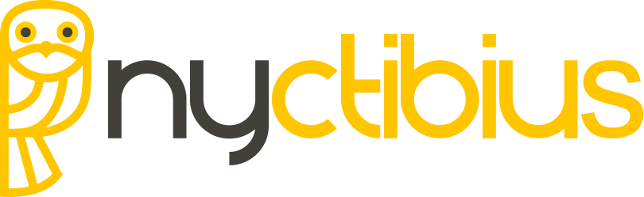

# Nyctibius - Streamlining sociodemographic data harmonizing. 

<!-- badges: start -->
[](https://github.com/biomac-lab/harmonize/blob/main/README.md)
[](https://github.com/biomac-lab/harmonize/blob/main/README.es.md)
[](https://opensource.org/license/mit/)
[](https://github.com/r-lib/usethis/actions/workflows/R-CMD-check.yaml)
[](https://app.codecov.io/gh/%7B%7B%20gh_repo%20%7D%7D?branch=main)
[](https://www.reconverse.org/lifecycle.html#concept)
<!-- badges: end -->

The Python package Nyctibius is designed to streamline the complex task of gathering and consolidating sociodemographic data from various sources into a cohesive relational database. Nyctibius empowers users to effortlessly unify custom data sets from diverse socio-demographic sources, ensuring that they can work with up-to-date and comprehensive information in a seamless manner. This package facilitates the process of creating a harmonized repository of socio-demographic data, simplifying data management and analysis for users across various domains.

## Features

- Seamlessly retrieve data from online data sources through web scraping.
- Effortlessly extract data from diverse sources, consolidating it into a cohesive relational database.
- Conduct precise queries and apply transformations to meet specific criteria.
- Effectively manage data inconsistencies and discrepancies for enhanced accuracy.
- Support for various data formats, including .csv, .xlsx, .xls, .txt, and zip files, ensuring versatility in sourcing information.

## Installation

For full documentation, please refer to the [Nyctibius documentation](https://drive.google.com/file/d/1f2im1gzYpxrvfmiPllAvYWC21-ZzYLNg/view?usp=sharing).

You can install the Nyctibius package using pip. Make sure you have Python 3.x installed on your system; the package requires Python version 3.7 or higher.

```shell
pip install nyctibius
```

## Usage

To use the Nyctibius package, follow these steps:

1. Import the package in your Python script:

   ```python
   from nyctibius import Harmonizer
   ```

2. Create an instance of the `Harmonizer` class:

   ```python
   harmonizer = Harmonizer()
   ```

3. Extract data from online sources and create a list of data information:

   ```python
   url = 'https://www.example.com'
   depth = 0
   ext = 'csv'
   list_datainfo = harmonizer.extract(url=url, depth=depth, ext=ext)
   harmonizer = Harmonizer(list_datainfo)
   ```

4. Load the data from the list of data information and merge it into a relational database:

   ```python
   results = harmonizer.load()
   ```

5. Import the modifier module and create an instance of the `Modifier` class:

   ```python
   from nyctibius.db.modifier import Modifier
   modifier = Modifier(db_path='../../data/output/nyctibius.db')
   ```
   
6. Perfom modifications:

   ```python
   tables = modifier.get_tables()
   print(tables)
   ```
   
7. Import the querier module and create an instance of the `Querier` class:

   ```python
   from nyctibius.db.querier import Querier
   querier = Querier(db_path='data/output/nyctibius.db')
   ```

8. Perform queries:

   ```python
   df = querier.select(table="Estructura CHC_2017").execute()
   print(df)
   ```

## Supported Data Sources

The package supports the following sources:

- Colombian microdata links from National Administrative Department of Statistics (DANE)
- Local files
- Open data sources

Please note that accessing data from these organizations may require authentication or specific credentials. Make sure you have the necessary permissions before using the library.


## License

The Nyctibius package is open-source and released under the [MIT License](https://opensource.org/licenses/MIT). Feel free to use, modify, and distribute this library in accordance with the terms of the license.

## Acknowledgements

We would like to thank the following entities for providing the data used and the economic financial support for the development of this package:

- National Administrative Department of Statistics (DANE)
- Barcelona Supercomputing Center (BSC)
- Universidad de los Andes

## Contact

For any questions, suggestions, or feedback regarding the package please contact:

Erick lozano,
Email: es.lozano@uniandes.edu.co

Diego Irreño,
Email: dirreno@unal.edu.co

## Disclaimer

This library is not officially affiliated with or endorsed by any of the mentioned official organizations. The data provided by this library is sourced from publicly available information and may not always reflect the most current or accurate data. Please verify the information with the respective official sources for critical use cases.